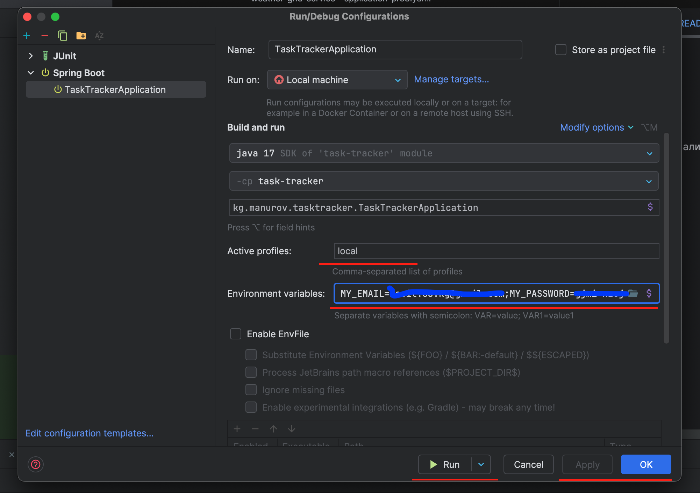

# Task Tracker API

REST API сервис для управления задачами с использованием Spring Boot.

## Описание проекта

Task Tracker API — это REST API-сервис для управления задачами с полным CRUD функционалом. Система реализует паттерн "Стратегия" для управления статусами задач, включает систему аутентификации, кэширование, логирование и отправку уведомлений по email.

### Функционал проекта:

1. **Управление задачами:**
    - Создание задачи со статусом "В ожидании"
    - Получение списка всех задач с сортировкой по дате создания
    - Обновление задачи (название, описание, статус)
    - Удаление задачи
    - Получение задачи по ID
    - Фильтрация задач по статусу

2. **Система статусов с паттерном "Стратегия":**
    - **PENDING** (В ожидании) → можно перейти в IN_PROGRESS, CANCELLED
    - **IN_PROGRESS** (В процессе) → можно перейти в COMPLETED, CANCELLED, PENDING
    - **COMPLETED** (Завершена) → финальный статус
    - **CANCELLED** (Отменена) → финальный статус

3. **Система пользователей:**
    - Регистрация новых пользователей
    - Basic Authentication для защиты API
    - Хеширование паролей с помощью BCrypt

4. **Кэширование:**
    - Redis используется для кэширования списка всех задач
    - TTL кэша - 30 минут
    - Автоматическая инвалидация при изменениях

5. **Отправка уведомлений:**
    - Email уведомления о создании/изменении задач
    - HTML шаблоны для писем
    - Настраиваемые SMTP параметры

6. **Логирование:**
    - Подробное логирование всех операций
    - Запись в файл `logs/spring.log`
    - Ротация логов (7 дней, макс. 10MB на файл)

7. **Внешние API:**
    - HTTP запрос на https://api.restful-api.dev/objects
    - Логирование полученных ответов

## Стек технологий:

- Java 17
- Spring Boot 3.5.3
- Spring Data JPA
- Spring Security (Basic Auth)
- Spring Cache + Redis
- Spring Mail
- H2 Database
- Liquibase (миграции)
- Swagger/OpenAPI 3
- Docker & Docker Compose
- Maven
- Lombok
- JUnit 5 + Mockito (тестирование)

## План выполненных задач:

### Основные требования ✅

- ✅ **REST API для управления задачами** - реализованы все CRUD операции
- ✅ **H2 Database** - подключена с Liquibase миграциями
- ✅ **Логирование** - полное логирование запросов, ответов и операций

### Дополнительные задания ✅

- ✅ **HTTP запрос на внешний API** - реализован запрос на https://api.restful-api.dev/objects
- ✅ **Unit-тесты** - написаны тесты для TaskService и TaskRepository (31 тест)
- ✅ **Email уведомления** - отправка HTML писем через Spring Mail
- ✅ **Basic Authentication** - защита API с помощью Spring Security
- ✅ **Redis кэширование** - кэширование списка задач
- ✅ **Dockerfile** - контейнеризация приложения

### Реализация сущностей и репозиториев

- Созданы модели и репозитории для:
    - Task, User с полным CRUD функционалом
    - TaskRequest DTO с валидацией данных

### Конфигурация

- **Redis:** используется для кэширования списка всех задач. Позволяет значительно снизить время отклика API. Ключи формируются по шаблону tasksCache:all_tasks, время жизни кэша (TTL) — 30 минут.
- **Slf4j:** Логирование всех действий через Lombok Slf4j.
- **SecurityConfig:** Basic Authentication для защиты всех эндпоинтов кроме регистрации.
- **GlobalExceptionHandler:** Исключения обрабатываются централизованно для каждой сущности.

### Валидация данных

- Все DTO, принимаемые через POST и PUT запросы, проходят валидацию на корректность. Дополнительно для класса TaskRequest реализована кастомная аннотация для проверки статусов и переходов между ними.

### Паттерн "Стратегия" для управления статусами

- Реализована логика на основе паттерна "Стратегия" для управления переходами между статусами задач.

### Функциональность

- Регистрация пользователей и аутентификация.
- Управление задачами (CRUD).
- Изменение статусов с валидацией переходов.
- Отправка email уведомлений при создании/изменении задач.
- Получение информации о доступных переходах статусов.

## Особенности проекта:

- **Паттерн "Стратегия":** для управления статусами задач реализован паттерн Strategy, который позволяет гибко управлять переходами между состояниями и выполнять соответствующую бизнес-логику.
- **Redis:** используется для кэширования списка задач. Позволяет существенно снизить нагрузку на базу данных. Ключи формируются динамически, с TTL 30 минут.
- **Basic Authentication:** все эндпоинты защищены с помощью Spring Security, кроме эндпоинта регистрации.
- **Email уведомления:** интегрирована отправка HTML писем через Spring Mail при создании и изменении задач.
- **Автоматическое логирование:** все операции логируются с помощью аннотации @Slf4j от Lombok.
- **Кастомные валидации:** реализованы отдельные валидаторы, чтобы вынести бизнес-валидации за пределы сервисного слоя.
- **Comprehensive Testing:** написаны unit и integration тесты с покрытием основного функционала.
- **Docker:** проект и база данных запускаются в Docker-окружении с использованием Docker Compose для удобства развертывания и управления контейнерами.
- **Профилирование окружений (`application.yml`, `application-test.yml`, `application-prod.yml`):** используется механизм Spring Profiles для разделения конфигураций разработки, тестирования и продакшена. Настройки окружения (базы данных, Redis, логгирование, SMTP и т.д.) подгружаются в зависимости от активного профиля.

## Запуск проекта:

### Локальный запуск:
1. Клонируйте репозиторий.
2. Для запуска локально настройте переменные окружения в IDE:
   ```
   MY_EMAIL=your_email@gmail.com
   MY_PASSWORD=your_app_password
   ```
   
3. Запустите приложение: `mvn spring-boot:run`

### Запуск через Docker Compose:
```bash
MY_EMAIL=your_email@gmail.com MY_PASSWORD="your_app_password" docker compose up -d
```

### Доступ к сервисам:
- **API:** http://localhost:8888 (локально) или http://localhost:9778 (Docker)
- **Swagger UI:** http://localhost:8888/swagger-ui.html (локально) или http://localhost:9778/swagger-ui.html (Docker)
- **Swagger docs:** http://localhost:8888/api/v3/api-docs (для Postman проверки)
- **Redis:** localhost:6379

## API Документация:

### Основные эндпоинты:
```
POST   /api/v1/tasks              - Создание задачи
GET    /api/v1/tasks              - Получение всех задач
GET    /api/v1/tasks/{id}         - Получение задачи по ID
PUT    /api/v1/tasks/{id}         - Обновление задачи
DELETE /api/v1/tasks/{id}         - Удаление задачи
PATCH  /api/v1/tasks/{id}/status  - Изменение статуса
GET    /api/v1/tasks/status/{status} - Фильтрация по статусу
GET    /api/v1/tasks/{id}/transitions - Доступные переходы
GET    /api/v1/tasks/status-info  - Информация о статусах
```

### Аутентификация:
```
POST /api/auth/register - Регистрация пользователя
```

### Тестовые данные:
В базе созданы тестовые пользователи для демонстрации:
- **Email:** qwe@qwe, **Password:** qwe
- **Email:** qwe@qwe.qwe, **Password:** qwe

### Структура проекта:
```
src/
├── main/
│   ├── java/kg/manurov/tasktracker/
│   │   ├── controller/          # REST контроллеры
│   │   ├── service/            # Бизнес-логика
│   │   ├── strategy/           # Паттерн стратегия для статусов
│   │   ├── domain/            # Модели и DTO
│   │   ├── repositories/      # JPA репозитории
│   │   ├── config/           # Конфигурация
│   │   ├── exception/        # Кастомные исключения
│   │   ├── handler/         # Обработчики ошибок
│   │   └── validations/     # Кастомные валидаторы
│   └── resources/
│       ├── db/changelog/    # Liquibase миграции
│       └── templates/       # Email шаблоны
└── test/                   # Тесты
```

### Тестирование:
Запуск тестов: `mvn test`

Покрытие включает:
- Unit-тесты для TaskService (26 тестов)
- Integration-тесты для TaskRepository (20 тестов)
- Тесты загрузки контекста приложения

---

**Все требования тестового задания выполнены ✅**